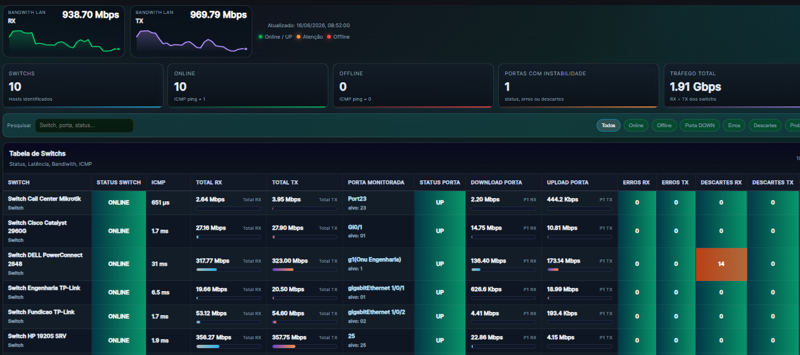
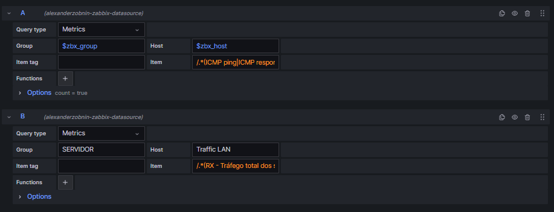
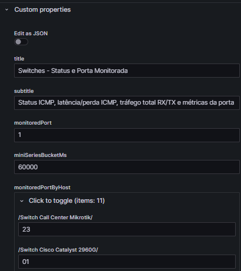
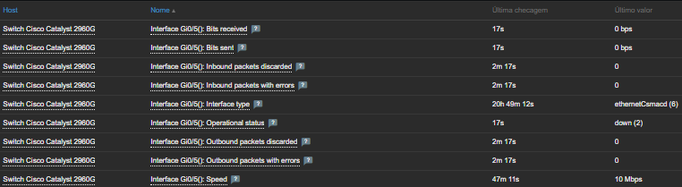
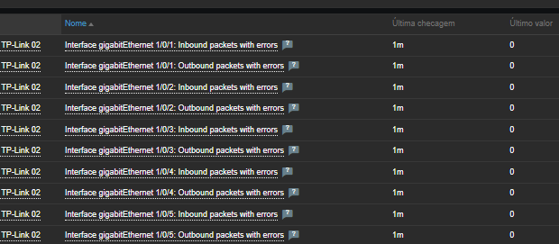

# Monitoramento da saúde da rede LAN


## 1. Objetivo do projeto

Essa dashboard foi criada para monitorar switchs a partir de itens coletados no Zabbix via SNMP. O foco principal é dar uma visão da saúde da rede.
- status geral dos switchs via ICMP;
- latência/perda ICMP;
- tráfego RX/TX da LAN;
- tráfego RX/TX por switch;
- porta de cascateamento/uplink monitorada por switch;
- status operacional da porta monitorada;
- erros, descartes e CRC relacionados às interfaces;
- identificação de portas com instabilidade.

A dashboard ajuda a identificar preventivamente falhas e instabilidades na rede, como switchs offline, portas de cascateamento fora do ar, aumento de latência, perda de pacotes, excesso de tráfego, gargalos em uplinks, erros de CRC, descartes de pacotes, problemas físicos em cabos ou portas e negociação incorreta de velocidade/duplex. Com essas informações centralizadas, é possível agir antes que o problema afete vários usuários, evitando lentidão em sistemas, quedas de conexão, falhas intermitentes e maior tempo de indisponibilidade.


Com pequenas modificações é possível utilizar Outros tipos de Datasource.

Grafana Labs: https://grafana.com/orgs/marcusronney/dashboards

---

## 2. Tecnologias usadas

A dashboard depende principalmente de:

| Componente | Uso |
|---|---|
| Grafana | Visualização e execução das queries |
| Zabbix datasource | Fonte de dados dos switchs |
| Zabbix SNMP | Coleta das métricas dos equipamentos |
| HTML Graphics Panel | Plugin para Redenrização HTML/CSS/JavaScript |
| JavaScript `onRender` | Processamento das séries retornadas pelo Grafana |
| HTML | Estrutura visual da tabela, cards e cabeçalho |
| CSS | Estilo visual, cores, layout, responsividade |


---

## 3. Dashboard



A Dashboard é composta pelos seguintes cards:

1. **Cabeçalho**
   - mini time series de RX e TX;
   - horário da última atualização;
   - legenda de status.

2. **Cards KPI**
   - total de switchs identificados;
   - switches online;
   - switches offline;
   - portas com instabilidade;
   - tráfego total RX + TX.

3. **Barra de pesquisa e filtros**
   - pesquisa por switch, porta ou status;
   - filtros rápidos: todos, online, offline, porta down, erros, descartes e problemas.

4. **Tabela de switches**
   - status do switch;
   - ICMP;
   - total RX;
   - total TX;
   - porta monitorada;
   - status da porta;
   - download/upload da porta;
   - erros RX/TX;
   - descartes RX/TX;
   - última coleta.

---

## 4. Datasource



A dashboard usa queries do datasource Zabbix.

### Query A: switches e portas

Regex
```
/.*(ICMP ping|ICMP response time|ICMP loss|icmpping|icmppingsec|icmppingloss|Bits received|Bits sent|Operational status|Inbound packets discarded|Outbound packets discarded|Inbound packets with errors|Outbound packets with errors|ifOperStatus|ifInErrors|ifOutErrors|ifInDiscards|ifOutDiscards).*/`
```

A query busca os itens dos switchs no Zabbix.

Exemplo:

```text
Group = $zbx_group
Host  = $zbx_host
Item  = $zbx_item_filter
```

Essa query retorna séries de itens SNMP dos switchs. O JavaScript do painel percorre essas séries e identifica o que cada item representa.

Exemplos:

```
ICMP ping
ICMP response time
ICMP loss

Interface Gi0/1(): Bits received
Interface Gi0/1(): Bits sent
Interface Gi0/1(): Operational status

Interface Gi0/1(): Inbound packets with errors
Interface Gi0/1(): Outbound packets with errors

Interface Gi0/1(): Inbound packets discarded
Interface Gi0/1(): Outbound packets discarded

Interface Gi0/1(): CRC/FCS errors
```

### Query B: tráfego total calculado no Zabbix

Regex
````
/.*(RX - Tráfego total dos switchs|TX - Tráfego total dos switchs).*/
````

Ela busca itens calculados no host.

```
Host: Traffic LAN
Item: RX - Tráfego total dos switchs
Item: TX - Tráfego total dos switchs
```

Exemplo de filtro no campo Item:

```regex
/.*(RX - Tráfego total dos switchs|TX - Tráfego total dos switchs).*/
```

Quando a Query B retorna dados, os mini gráficos do cabeçalho e o card **Tráfego total** usam esses valores calculados pelo Zabbix.

Quando a Query B não retorna dados, o JavaScript usa como fallback a soma feita no próprio painel.

---

## 5. Soma do trafego

O JavaScript lê todas as séries retornadas pelo Grafana e classifica os itens por tipo de métrica.

Para tráfego, ele reconhece nomes/chaves que correspondem a:

```text
Bits received
Bits sent
incoming traffic
outgoing traffic
inbound traffic
outbound traffic
net.if.in
net.if.out
ifHCInOctets
ifHCOutOctets
ifInOctets
ifOutOctets
```

Depois, para cada switch, ele soma todas as portas reconhecidas.

Exemplo:

```javascript
let totalRx = 0;
let totalTx = 0;

device.ports.forEach((port) => {
  const rx = metricValueToNumber(port.bitsReceived);
  const tx = metricValueToNumber(port.bitsSent);

  if (Number.isFinite(rx)) totalRx += rx;
  if (Number.isFinite(tx)) totalTx += tx;
});
```

Resultado:

```text
Total RX do switch = soma de RX das portas reconhecidas
Total TX do switch = soma de TX das portas reconhecidas
Tráfego total LAN = soma RX + TX
```

---

## 6. Porta monitorada

É a porta principal de cascateamento/uplink ou porta crítica definida manualmente no switch.

É exibida nas colunas:

```text
PORTA MONITORADA
STATUS PORTA
DOWNLOAD PORTA
UPLOAD PORTA
ERROS RX
ERROS TX
DESCARTES RX
DESCARTES TX
```

Exemplo:

```text
Total RX/TX      = todas as portas reconhecidas
Download/Upload  = somente a porta monitorada
Erros/Descartes  = somente a porta monitorada
```

---

## 7. Configuração da porta monitorada por switch

A porta monitorada é definida nas **Custom properties** do painel HTML Graphics.



Exemplo:

```json
{
  "title": "Switches - Status e Porta Monitorada",
  "subtitle": "Status ICMP, latência/perda ICMP, tráfego total RX/TX e métricas da porta monitorada por switch",
  "monitoredPort": "1",
  "monitoredPortByHost": {
    "/Switch Call Center Mikrotik/": "15",
    "/Switch Cisco Catalyst 2960G/": "47",
    "/Switch D-Link Comercial/": "1",
    "/Switch Engenharia TP-Link/": "20",
    "/Switch ENGENHARIA/": "1",
    "/Switch Fundicao TP-Link/": "1",
    "/Switch HP 1920S SRV/": "2",
    "/Switch Mikrotik Girassol/": "15",
    "/Switch Semiacabado TP-Link 02/": "1",
    "/Switch Semiacabado TP-Link/": "10",
    "/Switch Servidor TP-Link/": "1"
  },
  "fallbackSpeedMbps": 1000,
  "usageWarnPct": 70,
  "usageCriticalPct": 90,
  "errorWarnCount": 1,
  "discardWarnCount": 1,
  "miniSeriesBucketMs": 60000
}
```

### Funcionamento

```text
monitoredPort = porta padrão
monitoredPortByHost = exceções por switch
```

Exemplo:

```json
"/Switch Cisco Catalyst 2960G/": "47"
```

Saída:

```text
Para o host que possuí o nome "Switch Cisco Catalyst 2960G",
a porta monitorada será a porta 47.
```

A chave pode ser:

- nome exato do host;
- parte do nome do host;
- regex.

Exemplos válidos:

```json
"/Cisco Catalyst/": "47"
"/Switch HP 1920S SRV/": "2"
"Switch Servidor TP-Link": "1"
```

---

## 8. Normalização de nomes de portas

Cada fabricante pode retornar Mibs com nomes diferentes, assim cada template pode retornar padrões de nomes diferentes.

Exemplos:

```text
Port1
SFP1
g1
Gi0/1
GigabitEthernet0/1
gigabitEthernet 1/0/1
Interface 32()
TRK 1
```

No Js eu criei uma padronização para esses nomes.

responsável por extrair, limpar e normalizar os nomes das portas:
````
portFrom()              extrai o nome da porta do item recebido do Zabbix
cleanPortName()         limpa sujeiras, prefixos e textos extras
normalizePortKey()      transforma nomes diferentes em uma chave comparável
getMonitoredPortForHost() escolhe a porta configurada para cada switch
isMonitoredPort()       compara a porta encontrada com a porta configurada
````

Exemplos:

```text
Gi0/47              → 47
GigabitEthernet0/47 → 47
gigabitEthernet 1/0/20 → 20
g1                  → 1
Port15              → 15
Interface 32()      → 32
```

Essa padronização permite usar apenas o número da porta nas **Custom properties**.

---

## 9. Status do switch

O status do switch é baseado nos itens ICMP do Zabbix.

Itens reconhecidos:

```text
ICMP ping
icmpping
Ping status
status ping
ping availability
disponibilidade icmp
```

Mapeamento:

```text
1 = ONLINE
0 = OFFLINE
```

A dashboard também reconhece latência e perda ICMP:

```text
ICMP response time
icmppingsec
ICMP loss
icmppingloss
packet loss
```

---

## 10. Status da porta

O status da porta é baseada na MIB `ifOperStatus`.

Mapeamento IF-MIB: https://mibs.observium.org/mib/IF-MIB/

| Valor | Status |
|---:|---|
| 1 | UP |
| 2 | DOWN |
| 3 | Testing |
| 4 | Unknown |
| 5 | Dormant |
| 6 | Not present |
| 7 | Lower layer down |

Na tabela, esses estados são convertidos para classes visuais:

```text
UP                → verde
DOWN              → vermelho
Testing/Dormant   → alerta
Unknown/Sem dado  → cinza
```

---

## 11. Erros, descartes e CRC

A dashboard procura por nomes de itens relacionados a erros e descartes.

Exemplo de itens de um Switch Cisco Catalyst:



### Erros RX

Reconhece padrões como:

```text
Inbound packets with errors
In errors
ifInErrors
RX errors
CRC errors RX
erros entrada
```

### Erros TX

Reconhece padrões como:

```text
Outbound packets with errors
Out errors
ifOutErrors
TX errors
CRC errors TX
erros saída
```

### Descartes RX

Reconhece padrões como:

```text
Inbound packets discarded
In discards
ifInDiscards
RX discards
descartes RX
```

### Descartes TX

Reconhece padrões como:

```text
Outbound packets discarded
Out discards
ifOutDiscards
TX discards
descartes TX
```

### CRC/FCS

Dependendo do template do Zabbix, CRC pode vir como item próprio ou embutido em nomes como:



```text
CRC/FCS errors
CRC errors RX
CRC errors TX
dot3StatsFCSErrors
```

O objetivo é conseguir capturar variações de nomenclatura entre Cisco, HP, Dell, Mikrotik, TP-Link e outros fabricantes.

---

## 12. Importante: evitar duplicidade de tráfego de itens no Zabbix

Para diminuir a duplicidade, o Regex é aplicado. Assim o Grafana irá procurar apenas os itens definidos no regex, a query ficará extremamente mais otimizada do que ao invés usar /.*/ para varrer todos os itens.

```regex
/.*(ICMP ping|ICMP response time|ICMP loss|Bits received|Bits sent|Operational status|Inbound packets discarded|Outbound packets discarded|Inbound packets with errors|Outbound packets with errors|CRC|FCS|ifInErrors|ifOutErrors|ifInDiscards|ifOutDiscards).*/
```

---

## 13. Itens calculados no Zabbix para tráfego total

Para melhorar performance, o tráfego total pode ser calculado no Zabbix em vez de ser somado no JavaScript.

Exemplo de host lógico:

```text
Traffic LAN
```

Itens:

```text
RX - Tráfego total dos switchs
TX - Tráfego total dos switchs
Total - Tráfego dos switchs
```

Fórmulas recomendadas, considerando itens padronizados `net.if.in[*]` e `net.if.out[*]`:

### RX total

```text
sum(last_foreach(/*/net.if.in[*]?[group="switch"]))
```

### TX total

```text
sum(last_foreach(/*/net.if.out[*]?[group="switch"]))
```

### Total RX + TX

```text
last(/Traffic LAN/RX_trafego) + last(/Traffic LAN/TX_trafego)
```

Na dashboard, a Query B deve buscar:

```regex
/.*(RX - Tráfego total dos switchs|TX - Tráfego total dos switchs).*/
```

Assim:

```text
Mini gráfico RX → usa item calculado RX
Mini gráfico TX → usa item calculado TX
Card Tráfego total → RX + TX calculados
Tabela → continua usando dados detalhados dos switches
```

---
